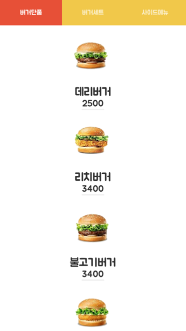

### 프로젝트명: 스마트폰과 Beacon을 이용한 무인 원격 주문 시스템

팀원 수: 4명 
개발 기간: 1달 
나의 역할: 코딩, 다이어그램 

사용 언어: Java, JSP 
사용 SDK: Android SDK, RECO SDK(for Adroid) 
사용 라이브러리: JSTL, GSON 
사용 툴: Android Studio 3.0, Eclipse Neon(4.6), Apache Tomcat 8.0, MySQL Workbench 6.3.10 

### 프로그램 설명
 
사진1-시작 화면 / 사진2-메뉴화면(비컨 신호가 잡히지 않아서 메뉴만 뜨고 선택은 불가능)
- 무인 주문용 앱
- 비컨을 통해 위치(지점)를 파악
- 지점에 따라 다른 메뉴를 보여줌
- 주문 내역을 웹서버를 통해 DB에 저장
- 주문이 완료되면 메시지 + 소리 + 진동으로 알림
- 지금까지의 주문 내역을 확인 가능

### 동작 과정
1. 앱 실행 시 로고 화면이 뜨고 비컨 신호를 통해 지점 파악
2. 해당 지점의 메뉴 목록을 불러옴(비컨 신호를 못 받은 경우 본점 메뉴)
3. 비컨이 잡힌 경우 메뉴 선택이 가능(+총 비용을 하단에 표시)
4. 선택 완료 시 선택한 메뉴와 가격을 보여주고 주문여부 선택 가능 
뒤로가기 시 메뉴 선택 화면으로 이동(선택한 메뉴는 유지)
5. 주문 시 웹서버 페이지에 주문 내역 전송 
웹서버를 통해 주문 내역을 DB에 저장
6. (선택)주문 내역 탭에서 현재 주문 내역을 포함한 모든 주문 내역을 확인 가능
7. 웹서버에서 주문 완료 처리 시 푸시 알림을 보냄

### 주요 기능
- 비컨 신호 확인
  - 웹서버에 신호를 보내 비컨의 major, minor 값 리스트를 받아옴(major:지역, minor:지점) 
  받아온 값과 UUID로 regions 목록 생성(허용 비컨 리스트)
  웹서버에 문제가 생긴 경우 경고문 표시 후 확인을 누르면 종료
  - 일정 시간 간격으로 비컨 신호를 받아와서 체크 
  주변의 모든 비컨 신호를 받아온 다음 regions 목록에 있는 것만 목록으로 생성 
  - 가장 거리가 가까운 비컨의 UID 값을 저장하고 메인 화면으로 이동 
  이후 주문 시 이 비컨과 동일한 비컨 신호를 받고있는지 체크(자리에서 벗어났는지 체크)
- 화면 이동
  - 작성중

### 겪었던 문제(기술)
- 문제
  - 내용

---

### 잡담

### 겪었던 문제(일상)
- 문제
  - 내용

### 소감
- 먼저 얘기할 것으로는 현재 남은 사진이 거의 없다. 
왜냐하면 일단 이게 안드로이드 앱인데, 난 아이폰 유저다. 
다른 기능은 앱플레이어에서도 테스트가 가능했지만 
비컨은 블루투스가 필요한데 앱플레이어에선 불가능했다. 
비컨을 제외한 테스트 버전도 따로 있지만 
프로젝트가 끝난 이후에 이클립스의 새 버전이 생겼기에 
덮어쓰는 방식으로 업데이트를 했다가 그만 망가져버렸다. 
새 버전을 별도로 설치하긴 했지만 관련 세팅을 다시 해야 한다. 
결국 귀찮아서 포기했다.  
작성중
